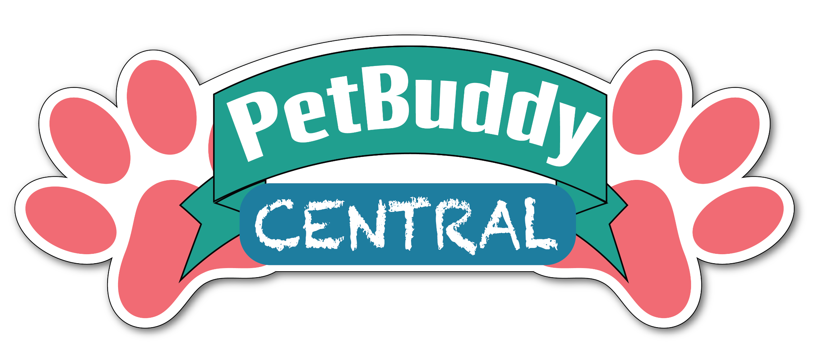
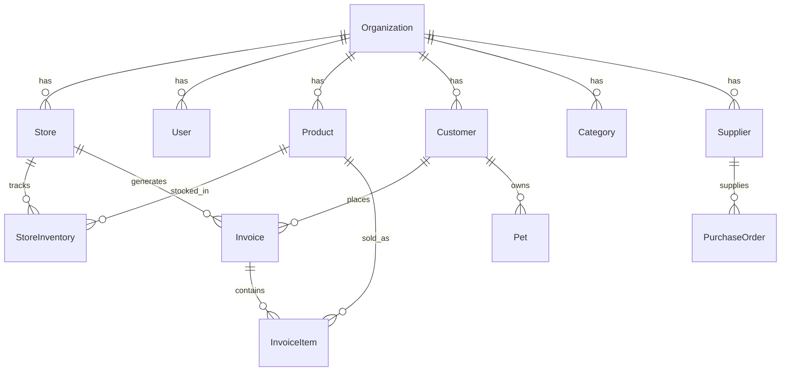

<h2>Connection branch</h2>
<p align="center">
  
</p>

<h1 align="center">🐾 PetBuddyCentral — Store Keeper</h1>

<p align="center">
  <strong>A modern, multi-tenant Point of Sale & Inventory Management System for pet stores</strong>
</p>

<p align="center">
  <a href="#features">Features</a> •
  <a href="#tech-stack">Tech Stack</a> •
  <a href="#getting-started">Getting Started</a> •
  <a href="#architecture">Architecture</a> •
  <a href="#project-structure">Project Structure</a> •
  <a href="#contributing">Contributing</a>
</p>

---

## 📋 Overview

**PetBuddyCentral Store Keeper** is a comprehensive, web-based Point of Sale (POS) and Inventory Management System designed specifically for **P.B.C. Pet Buddy LLP**. It supports multi-store franchise operations with role-based access control, real-time inventory tracking, customer & pet management, and analytics dashboards.

Built for the Indian pet retail market with **GST compliance**, **multi-store support**, and **franchise management** capabilities.

## ✨ Features

### 🏢 Multi-Tenant Architecture
- Organization-level management for franchise operations
- Individual store configurations with unique settings
- Cross-store analytics and reporting

### 👥 Role-Based Access Control
| Role | Access Level |
|------|-------------|
| **Super Admin** | Full system access — manage organizations, stores, users, view all analytics |
| **Franchise Owner** | Store-level management — inventory, staff, reports for their stores |
| **Store Manager** | Day-to-day operations — POS, inventory, customer management |

### 📦 Inventory Management
- Real-time stock tracking with low-stock alerts
- Batch tracking with expiry date management
- Stock adjustment logging (receive, damage, theft, correction, return)
- Automated reorder point triggers

### 🛒 Point of Sale
- Fast checkout with product search
- Multiple payment methods (Cash, UPI, Card, Mixed)
- Invoice generation with shareable public URLs
- Discount and tax (GST) management

### 🐕 Customer & Pet Management
- Customer profiles with purchase history
- Pet profiles with breed, dietary needs & medical conditions
- Loyalty program (Bronze → Silver → Gold tiers)
- Loyalty points tracking

### 📊 Analytics & Reporting
- Revenue dashboards with interactive charts (Recharts)
- Inventory analytics
- Customer insights
- Store-level and organization-level reporting

### 🔧 Operations
- Shift management (clock in/out, breaks)
- Cash drawer reconciliation
- Purchase order management with suppliers
- Comprehensive audit logging

## 🛠️ Tech Stack

| Layer | Technology |
|-------|-----------|
| **Framework** | [Next.js 16](https://nextjs.org/) (App Router) |
| **Language** | TypeScript |
| **Database** | SQLite (via Prisma ORM) |
| **Authentication** | NextAuth.js v5 (beta) |
| **Charts** | Recharts |
| **Icons** | Lucide React |
| **Styling** | CSS (globals.css) |

## 🚀 Getting Started

### Prerequisites

- **Node.js** ≥ 18
- **npm** ≥ 9

### Installation

1. **Clone the repository**
   ```bash
   git clone https://github.com/ojas1999tripathi/PetBuddyCentral-StoreKeeper.git
   cd PetBuddyCentral-StoreKeeper/app
   ```

2. **Install dependencies**
   ```bash
   npm install
   ```

3. **Set up environment variables**
   ```bash
   cp .env.example .env
   ```
   Edit `.env` with your configuration (see [Environment Variables](#environment-variables)).

4. **Set up the database**
   ```bash
   npm run db:setup
   ```
   This pushes the Prisma schema and seeds the database with initial data.

5. **Start the development server**
   ```bash
   npm run dev
   ```

6. **Open in browser**
   Navigate to [http://localhost:3000](http://localhost:3000)

### Default Login Credentials

After seeding, use these credentials to log in:

| Role | Email | Password |
|------|-------|----------|
| Super Admin | `admin@petbuddycentral.com` | `admin123` |
| Franchise Owner | `franchise@petbuddycentral.com` | `franchise123` |
| Store Manager | `store@petbuddycentral.com` | `store123` |

> ⚠️ **Change these credentials immediately in production!**

## ⚙️ Environment Variables

| Variable | Description | Example |
|----------|-------------|---------|
| `DATABASE_URL` | SQLite database file path | `file:./dev.db` |
| `AUTH_SECRET` | NextAuth.js secret key | `your-secret-key-here` |
| `AUTH_URL` | Application URL | `http://localhost:3000` |

## 📁 Project Structure

```
PetBuddyCentral-StoreKeeper/
├── README.md                  # This file
├── CONTRIBUTING.md            # Contribution guidelines
├── logo.png                   # PetBuddyCentral branding
└── app/                       # Next.js application
    ├── app/                   # App Router pages
    │   ├── api/auth/          # NextAuth API routes
    │   ├── login/             # Login page
    │   ├── super-admin/       # Super Admin dashboard
    │   ├── franchise/         # Franchise Owner dashboard
    │   ├── store/             # Store Manager dashboard
    │   ├── globals.css        # Global styles
    │   ├── layout.tsx         # Root layout
    │   └── page.tsx           # Landing/redirect page
    ├── lib/                   # Shared utilities
    │   ├── auth.ts            # NextAuth configuration
    │   ├── prisma.ts          # Prisma client singleton
    │   └── utils.ts           # Helper functions
    ├── prisma/
    │   ├── schema.prisma      # Database schema
    │   └── seed.ts            # Database seeder
    ├── public/                # Static assets
    ├── middleware.ts           # Auth middleware
    ├── package.json
    └── tsconfig.json
```

## 🗄️ Database Schema

The application uses a comprehensive relational schema designed for multi-tenant pet store operations:



### Key Models
- **Organization** — Top-level franchise entity
- **Store** — Individual pet store locations
- **User** — Staff with role-based access (Super Admin, Franchise Owner, Store Manager)
- **Product** — Items with SKU, pricing, HSN codes, and variants
- **StoreInventory** — Per-store stock levels with thresholds
- **Invoice** — Sales transactions with GST compliance
- **Customer** — Buyers with loyalty tiers and pet profiles
- **Pet** — Pet profiles linked to customers
- **PurchaseOrder** — Supplier ordering and receiving

## 📜 Available Scripts

| Command | Description |
|---------|-------------|
| `npm run dev` | Start development server |
| `npm run build` | Build for production |
| `npm run start` | Start production server |
| `npm run lint` | Run ESLint |
| `npm run db:push` | Push Prisma schema to database |
| `npm run db:seed` | Seed database with initial data |
| `npm run db:setup` | Push schema + seed (first-time setup) |
| `npm run db:studio` | Open Prisma Studio (DB GUI) |

## 🤝 Contributing

Please read [CONTRIBUTING.md](CONTRIBUTING.md) for details on our code of conduct and the process for submitting pull requests.

## 📄 License

This project is proprietary software developed for **P.B.C. Pet Buddy LLP**.

---

<p align="center">
  Made with ❤️ for <strong>PetBuddyCentral</strong>
</p>
